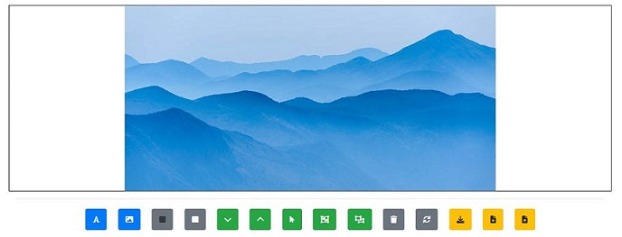

Result:
-------

Dependencies:
-------------
> jQuery 3.6.0 Bootstrap 4.6.1 Font Awesome 6 Fabric Canvas Lib 3.4.0

Note:
-----

Change **image file path** inside 'data/json_str.txt' for 'Load Json' (last button) to work. Or click 'Download Json' (second last button) and replace old 'data/json_str.txt' with the downloaded 'json_str.txt'.

